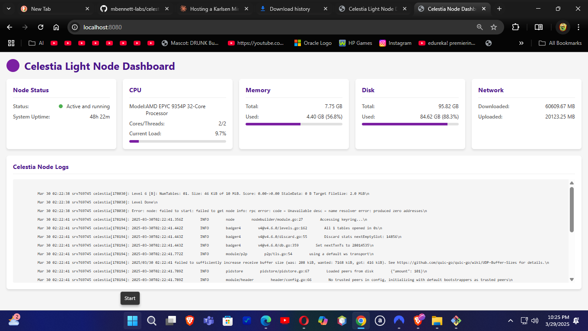

## Dashboard Preview

The custom monitoring dashboard provides real-time visualization of node status, resource utilization, and log analysis.# Celestia Light Node Implementation

A professional implementation of a Celestia Light Node with real-time monitoring dashboard, optimized for VPS environments where resource management is critical.

## Project Overview

This project demonstrates practical blockchain infrastructure management on a resource-constrained VPS. It combines several key technologies:

- **Celestia Light Node**: A modular blockchain data availability node
- **Real-time Monitoring**: Custom dashboard for node statistics and health metrics
- **Resource Optimization**: Configured for minimal impact on co-hosted services
- **Systemd Service Management**: Properly daemonized for production-level reliability

## Architecture

The implementation consists of two main components:

1. **Celestia Light Node**
   - Participates in the Celestia network data availability layer
   - Configured for minimal resource consumption
   - Running as a systemd service for reliability

2. **Node Monitoring Dashboard**
   - Real-time performance metrics
   - Node health status and connection details
   - System resource utilization visualization
   - Log monitoring and analysis

## Technical Specifications

### Celestia Node

- Implements Celestia's light node protocol
- Connects to the Celestia mainnet
- Configured with resource constraints:
  - 2GB memory limit
  - Balanced CPU priority
  - Controlled I/O operations

### Monitoring Dashboard

- Built with Node.js and Express
- Real-time metrics using systemd hooks
- Resource utilization graphs
- Secure access via SSH tunneling
- Low overhead design (< 20MB memory usage)

## System Requirements

- Ubuntu 24.04 LTS or similar Linux distribution
- 2+ CPU cores
- 4GB RAM minimum
- 60GB+ storage
- Go 1.21+ runtime
- Node.js 20+ (for dashboard)

## Security Considerations

This implementation includes several security best practices:

- No direct exposure of dashboard to the internet
- SSH tunnel access only
- Resource isolation to prevent DoS vulnerabilities
- Systemd service hardening

## Implementation Details

The repository contains complete documentation and code for:

- Node installation and configuration
- Dashboard setup and customization
- Systemd service definitions
- Resource limit configurations
- Monitoring scripts

## Potential Applications

This project demonstrates skills applicable to:

- Blockchain infrastructure management
- Decentralized application (dApp) backend services
- Cryptocurrency node operations
- Cloud resource optimization
- DevOps for blockchain projects

## License

MIT

## Contact

For more information, contact me through my [portfolio site](https://yourportfolio.com) or [LinkedIn](https://linkedin.com/in/yourprofile).
